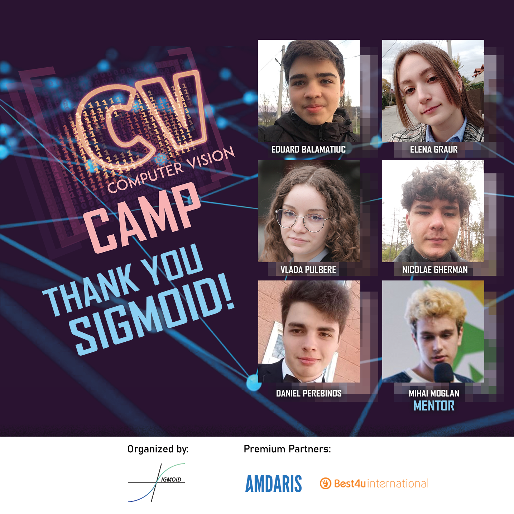

# _Paza Anulare Computer Vision Camp_
                      

------------------

#### __This GitHub repository contains all the "Paza Anulare" team's work throughout the Computer Vision Camp.__

> This project represents an application that provides a new perspective to the online meetings by introducing gesture control with Coputer Vision and creating a virtual camera compatible with every single online meetings application.

---

##### First of all please download all the library requirments using the `requirments.txt` file from above so the project could work properly on your computer.

##### [Here](https://www.youtube.com/watch?v=mBcmdcmZXJg&ab_channel=JieJenn) is a tutorial on how to do it properly

---

## These are the posibilities of the chatbot with all the features which we designed and included in this project:

- Live Edit
  
  -The tool allows the user to edit and transform documents live during the meeting and modify them as you wish. You can add text, drawings, geometric figures and also transform functions into graphics( The graphics feature can get as input many different types of mathematical functions as power, rational, modulus, polynomial and trigonometric ones and then convert them into graphics images).
  
  ---

- Attendance check of participants
  -Since the start of online classes and meetings, the presence of the students has always been a problem for the professors and lecturers, therefore we designed a simple but inovative tool whichs main purpose is to detect if the participant is actually present or not by identifying him during the meeting through the camera. Afterwards, when the meeting is done the admin will get a concise statistics about the attendance on all the participants
  
  ---

- Mood detection of the participants
  
  This particular features purpose was to keep a record on the emotions and overall mood of each participant. That being said we created a mood detector which is constantly analyzing you're posture and mimic throughout the meeting, using the deepface module, and gathering data, analyzing it and providing some statistics to the administrator, which can be shared with other members then. This way the speaker could get an instant feedback about his presentation and improve the online conference experience.
  
  ---

- American Sign-Language
  -The feature uses yolov5m module to detect the symbol represented by the users hand, subsequently it predicts the letter with an accurancy of 94.76%. This makes it easier for deaf people to interact live in online meetings, consequently improving the quality of the webinars. 
  
  ---

- Sport Activity
  
  In this part of the project we thought about an alternative to the sport online classes, and a solution to keeping a healthy lifestyle while being at home in quarantine for instace. So using mediapipe we created a small virtual trainer who's mission will be to keep you up during the workout suggesting different exercises, doing all the counting part for you, and not only that but also it will make sure that youre posture is correct throughout the exercise, this way reducing the probability of injuries considerably.
  
  It works on a simple concept, first it detects the specific part of the body on which you are working, then measures the angle between the three points of the body part which you are training, therefore creating a percentage of the finality of the exercise, also counting the reps during this time.

---

## Big shout-out to Sigmoid for organizing this kind of events

